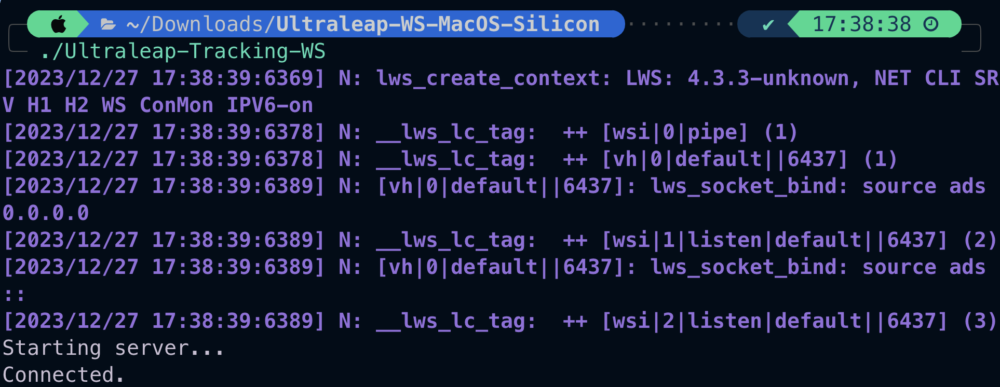
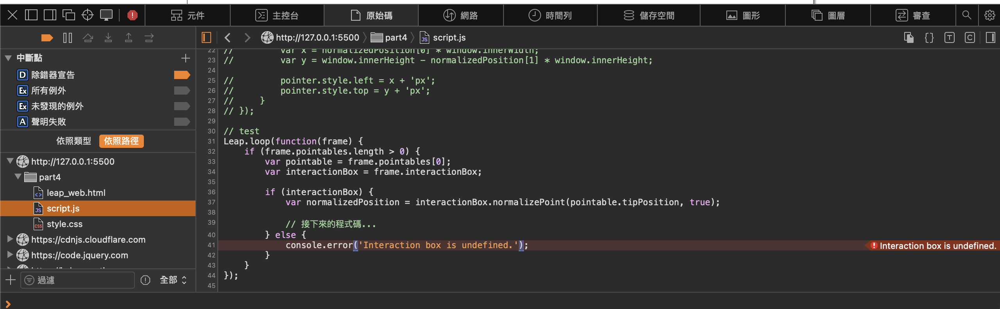

# leap_motion_final_report

## The demo video
- [demo_part1](https://youtu.be/rCLMMBPJpgE)
- [demo_part2](https://youtu.be/2XexNBB7koQ)

## Setting up environment
1. Download ultraleap as the link below
2. Start up Ultraleap-Tracking-WS.exe in windows_websocket first and don't turn it down.

(when it works, it should have above message)

3. Use part4 to test if the device is working.
4. Start to develop base on part1/2/3 or by yourself.

## Developing progress
1. Test if leap_motion device can use.(Okay)
2. Build a program with basic controls.(Okay)
3. Add control function to final presentation.(okaygi)

## Issues
 
1. The websocket problem, which is an issue that the leap_js company is still developing.

 

2.  Unsolved problem: Can't normalize.
We found out that interactionBox is unavilable

3. Reference Link

[gemini](https://leap2.ultraleap.com/gemini-downloads/)

[our_ppt](https://www.canva.com/design/DAF2FjIwo4c/ro0M585jEhGs9ekdUYk3eA/edit)

[medium_document](https://medium.com/physiatry/build-a-web-app-to-test-fine-motor-coordination-with-leap-motion-part-3-programming-tutorial-ec1e1333b0d3)

[original_github](https://github.com/gmarzloff/leap-tracer/tree/master)
